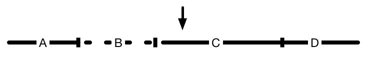

We've started playing a video with multiple discontinuities. The solid
line indicates content that has been downloaded and successfully
appended to a SourceBuffer. Dotted lines haven't been downloaded yet.

The viewer seeks to a point in the timeline that hasn't been
downloaded, after a couple discontinuities in segments that also
haven't been downloaded:

We use the information currently available to come up with a timestamp
offset for the new playback position. Segment D is downloaded and
appended:

The viewer decides to seek backwards again to the other side of the
closest discontinuity:

After downloading the new segment, we discover it's longer than the
manifest would lead us to believe. The timestamp offset we calculated
when appending segment D looks to be incorrect. If we were to append
segment C where it appears to belong in the media timeline, it would
overlap where we positioned D:

Ideally, there would be some way to adjust the position of the already
buffered data for segment D rather than removing it and having to
re-buffer:

